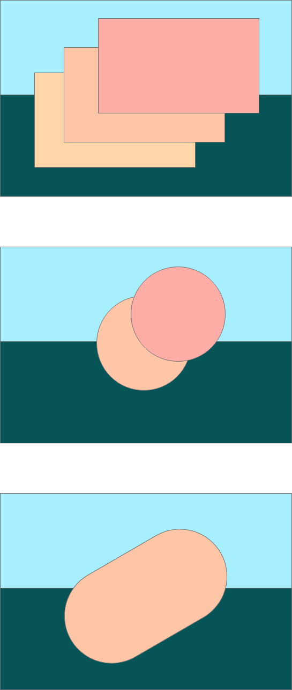
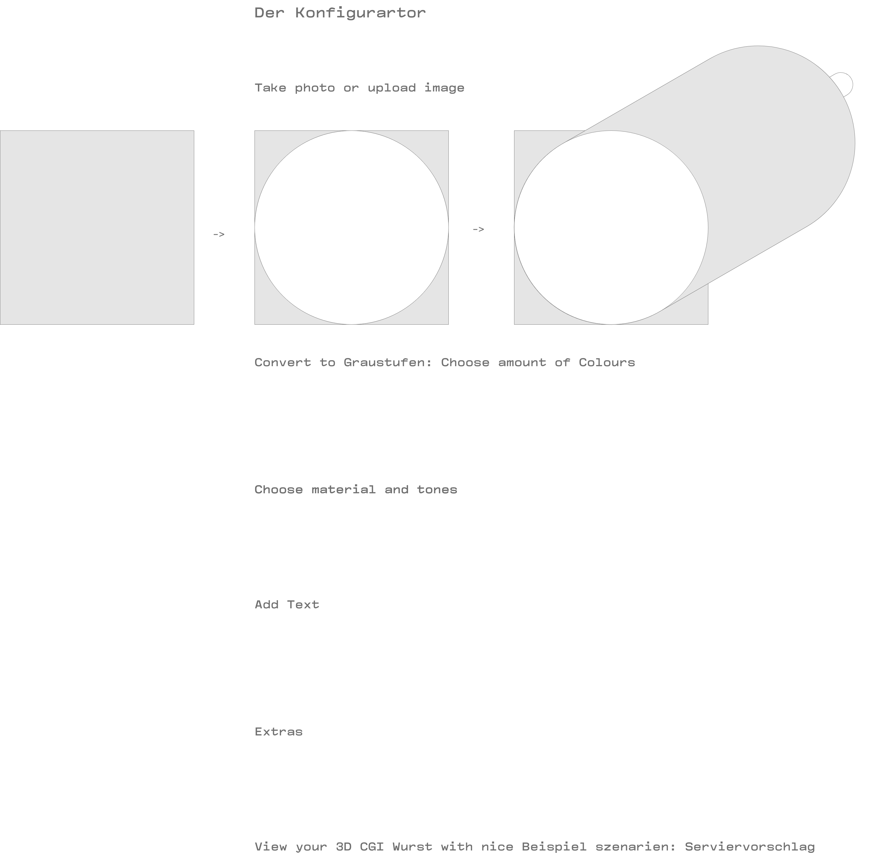

# Gesichtswurst / Face to Sausage App

* User friendly and super fast configuration
* Customizable Product: Take a photo directly or upload your own photo
* Choose between vegan, vegetarian or your favourite meat mix

## Um was geht’s?

1. Grotesques Brand CI Building zwischen Ironie, Trash und Global Warming 
2. Cutting Edge Webshop mit bester UX Config Tour

## Narrativ 

Die deutsche Identität und Kultur manifestiert sich hauptsächlich durch drei Dinge:
Kraftfahrzeug, Wurstwaren und Bier. Kein anderes Land hat eine so große Vielfalt an Autos, Wurst und Gerstensaft. Was den Franzosen die Liebe zum Käse ist, ist den deutschen das Krvaftfahrzeug und die Wurst. Autos sind konfigurierbar, repräsentieren und tragen das Ich nach Außen. Selbst die Dieselaffäre konnte daran nicht viel ändern. Bei den Bieren versuchen die großen internationalen Braukonzerne mit der Craftbeerszene Schrittzuhalten. 

Doch wie steht es um die Wurst? Die Wurst steckt in der Krise, der Fleischkonsum ist ebenfalls ins Fadenkreuz der Blame-Kultur Geraten. Was tun zwischen Gammelfleisch, grausamer Massentierhaltung und Klimaschädlichen Kühen? Die Fleischindustrie reagiert: Vegan Seitanbratlinge und vegetarische Soja Schnitzel. Doch ein Trend fehlt bisher in der neuen Wurstlandschaft: Individualisierung und Customer Experience.

Deutschlandweit gibt es über 1500 verschiedene Wurstspezialitäten und jede Region hat ihre weltbekannten Bratwürste. Gesichtswurst24 bietet die nächste, längst überfällige und logische Evolutionsstufe: Die Wurst 4.0

Die digital Experience verwandelt die Wurst als Medium und Plattform für ihre Ideen. Egal ob als Geburtstagsgeschenk, Firmenjubiläum oder die  In Erinnerung bleibende Hochzeitswurst als Dankeschön. 

Seien sie selbst der Inhalt und Botschafter ihrer ganz eigenen Wurst. Gestalten sie ihren Beitrag zur deutschen Lebenskultur der Zukunft.  Traditionsbewusst und Fortschrittsgewandt Hand in Hand.

With Wurst We Prosper.

## Fragen

Wer ist die Zielgruppe?
Surfende Pinterester und Investoren

## Marke

Bayerisch, regional, traditionsbewusst, ironisch, Wagneresque, 
Hidden Champion
Ist es Fake oder Wirklichkeit?

## Farben 

Dunkel Grün Samt
Leichtes Gold
Zum Anbeißen

## Bildsprache 

Animierte Gifs als Banner

## Ideen

Ein Fader mit der man den Qual-Grad des Tieres auswählen kann. 
0 = Vegan, bio, 100 karma punkte
1 = leicht vegetarisch, kann Spuren von EI und Milch enthalten, 
2 = vegetarisch bio, Enthält Ei, Milch oder ähnliche Tierderivate aus kontrolliert biologischem Anbau
3 = vegetarisch nicht-bio
4 = enthält Fleisch aus kontrolliert biologischem Anbau
5 = enthält Fleisch aus normaler Haltung

Schlaue Weisheiten und Kalender Sprüche Generator
(Thematisch passend)

## Claims

Wurst und Wahrheit

Lassen Sie sich eine Scheiben von Ihnen abschneiden.

Schneiden Sie sich ein Scheibchen von Ihnen ab.

Narziss. 

Das eigene Konterfei im Tier der Wahl zum Verschenken

Wir können die Wurst nicht sterben lassen. 
Wir müssen sie mitnehmen ins 21. Jahrhundert.
Durch uns in ihr in die Zukunft.

Der T-Shirt Generator für die Wurst

Geschenkidee: Ihr Glied als Wurst

„Ich mag Wurst“ Dafür steh ich mit meinem Gesicht

## Der Konfigurator

